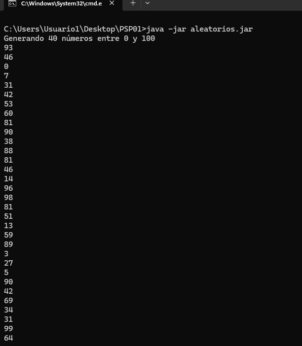

# 🔢 PSP01 - Ordenación de Números con Tuberías

Proyecto de Programación de Servicios y Procesos que demuestra el uso de **entrada/salida estándar** y **tuberías (pipes)** en Java mediante dos aplicaciones Maven independientes que trabajan en conjunto.

## 📋 Descripción

Este proyecto consta de dos aplicaciones Java Maven:

1. **`aleatorios`**: Genera números aleatorios entre 0 y 100
2. **`ordenarNumeros`**: Ordena números recibidos por entrada estándar

Ambas aplicaciones están diseñadas para trabajar de forma independiente o **conectadas mediante tuberías** (`|`), demostrando la comunicación entre procesos mediante streams estándar.

## 🗂️ Estructura del Proyecto

```
PSP01/
├── Aleatorios/
│   ├── pom.xml
│   └── src/
│       └── main/
│           └── java/
│               └── Aleatorios/
│                   └── aleatorios.java
│
└── OrdenarNumeros/
    ├── pom.xml
    └── src/
        └── main/
            └── java/
                └── OrdenarNumeros/
                    └── ordenarNumeros.java
```

## 🚀 Instalación y Compilación

### Prerequisitos

- **Java JDK 11** o superior
- **Maven 3.6** o superior


Generar a traves de las herramientas ofrecidas por Intelli J, los archivos JAR ejecutables en:
- `Aleatorios/target/aleatorios-1.0.jar`
- `OrdenarNumeros/target/ordenarNumeros-1.0.jar`

## 💻 Uso

### 1. Ejecutar `aleatorios` de forma independiente

Genera 40 números aleatorios:

```bash
java -jar aleatorios.jar
```

**Salida esperada:**
```
Generando 40 números entre 0 y 100
45
78
12
93
67
...
```

### 2. Ejecutar `ordenarNumeros` de forma independiente

Lee números desde la entrada estándar:

```bash
java -jar ordenarNumeros.jar
```

**Salida:**
```
NÚMEROS ORDENADOS
12
34
67
85
91
```
## 🎨 Wireframe
# Metodo Aleatorios


# Metodo ordenar Numeros 


## 🔗 Uso con Tuberías (Pipes)

### Conectar ambas aplicaciones

La característica principal de este proyecto es la **comunicación mediante tuberías**:

```bash
java -jar aleatorios.jar | java -jar ordenarNumeros.jar
```

**¿Qué hace este comando?**
1. `aleatorios` genera 40 números aleatorios y los envía a `stdout`
2. El operador `|` captura esa salida
3. La salida se redirige como entrada (`stdin`) de `ordenarNumeros`
4. `ordenarNumeros` ordena los números y muestra el resultado

**Resultado:**
```
Generando 40 números entre 0 y 100

NÚMEROS ORDENADOS
2
7
11
15
...
98
100
```

## 📊 Características Técnicas

### `aleatorios`

- ✅ Genera números entre 0 y 100 (configurable)
- ✅ Cantidad por defecto: 40 números
- ✅ Acepta cantidad personalizada como argumento
- ✅ Mensajes informativos enviados a `stderr` (no interfieren con tuberías)
- ✅ Salida limpia a `stdout` para fácil procesamiento

### `ordenarNumeros`

- ✅ Lee números desde `stdin`
- ✅ Ordena de menor a mayor
- ✅ Manejo robusto de errores
- ✅ Ignora líneas vacías
- ✅ Advertencias para entradas no válidas (enviadas a `stderr`)
- ✅ Compatible con redirección de archivos

## 🛠️ Configuración de Maven

Ambos proyectos incluyen configuración Maven para generar JARs ejecutables:

```xml
    <build>
        <finalName>aleatorios</finalName>
        <plugins>
            <plugin>
                <groupId>org.apache.maven.plugins</groupId>
                <artifactId>maven-jar-plugin</artifactId>
                <version>3.4.1</version>
                <configuration>
                    <archive>
                        <manifest>
                            <mainClass>Aleatorios.aleatorios</mainClass>
                        </manifest>
                    </archive>
                </configuration>
            </plugin>
        </plugins>
    </build>
```

## 🧪 Casos de Prueba

### Prueba 1: Ejecución básica con tubería
```bash
java -jar aleatorios.jar | java -jar ordenarNumeros.jar
```
**Esperado**: 40 números ordenados de 0 a 100

### Prueba 2: Cantidad personalizada
```bash
java -jar aleatorios.jar 25 | java -jar ordenarNumeros.jar
```
**Esperado**: 25 números ordenados

## 🐛 Solución de Problemas

### Error: "no main manifest attribute"

**Causa**: El JAR no tiene configurada la clase principal.

**Solución**: Verifica que el `pom.xml` incluya el plugin `maven-jar-plugin` con la configuración correcta de `mainClass`.

### Error: "Could not find or load main class"

**Causa**: El paquete no coincide con la estructura de directorios.

**Solución**: 
- Verifica que `package Aleatorios;` coincida con la carpeta `src/main/java/Aleatorios/`
- Recompila con `mvn clean package`

## 📚 Conceptos Demostrados

- ✅ **Entrada/Salida Estándar**: Uso de `System.in`, `System.out`, `System.err`
- ✅ **Comunicación entre Procesos**: Tuberías en línea de comandos
- ✅ **Separación de Responsabilidades**: Cada aplicación tiene una función específica
- ✅ **Modularidad**: Proyectos Maven independientes
- ✅ **Redirección de Streams**: Compatible con `>`, `<`, `|`
---

⭐ Si este proyecto te fue útil, ¡no olvides darle una estrella en GitHub!
